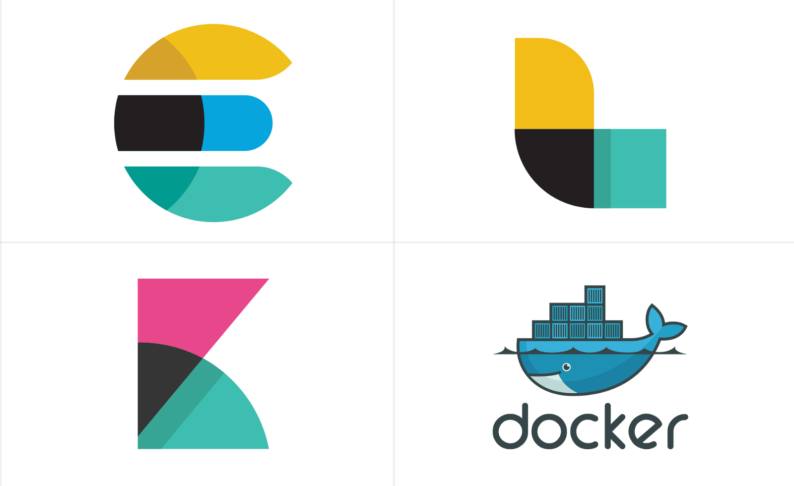

<p align="center"> 

</p>

# Docker ELK-APM stack

[](://github.com/amalcp/Dockerized-ELK-APM-Server/issues)

Run the latest version of the ELK - APM (Elasticsearch, Logstash, Kibana, APM) stack with Docker and Docker Compose.

It will give you the ability to analyze any data set by using the searching/aggregation capabilities of Elasticsearch
and the visualization power of Kibana. APM will help you to application performance Monitoring.


## Usage

### Bringing up the stack

**Note**: In case you switched branch or updated a base image - you may need to run `docker-compose build` first

Start the ELK stack using `docker-compose`:

```console
$ docker-compose up
```

You can also choose to run it in background (detached mode):

```console
$ docker-compose up -d
```

Give Kibana a few seconds to initialize, then access the Kibana web UI by hitting
[http://localhost:5601](http://localhost:5601) with a web browser.

By default, the stack exposes the following ports:
* 5000: Logstash TCP input.
* 9200: Elasticsearch HTTP
* 9300: Elasticsearch TCP transport
* 5601: Kibana
* 8200: APM

